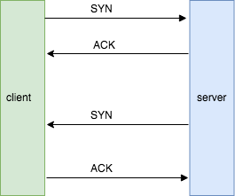
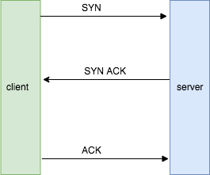
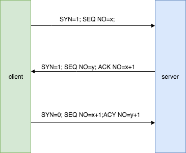

# **tcp为何三次握手、四次挥手**

## 1、三次握手(为何是三次呢)

​	大家都知道，tcp是可靠的通信协议，那么问题来了：是通过什么方式来保证tcp的‘可靠’性呢？这就在于客户端和服务端任何一方发出请求(SYN)，另一方就必须给出一个回应（ACK），这个过程是双向的，所以任何一方都可以主动向另一方发出请求(这是不同于http的)。

​	通过上面的介绍，相信大家已了解：要建立可靠的连接，首先双方要先确认彼此的身份,如下:

​    是否觉得大功告成了呢？完美？这样就能让双方100%的确认对方的身份？然而不是的，始终都有一方无法100%保证对方还处于服务状态，如上图，虽然server收到了client的ACK，但是 client依旧无法保证server在线，除非S端再发一次ACK。所以不管怎样都无法100%的确认，所以4次是上线了。
  上图模式存在的问题：

- 网络通讯成本是相当高的，网络延迟是无法预料的，所以发一次请求，都能大大的减少成本，提高效率
- 两轮的SYN ACK之间必须有联系，他们都是确认对方通讯是否可靠，属于同一次请求的逻辑，如果毫无联系，相隔的时间太长，无法保证是一个正常的建立链接的操作

所以，第二轮的SYN/ACK 必须和第一轮的 SYN/ACK 有关联。

很容易想到在第二步的时候，将ACK 和 SYN同时发过去，如下图

​						            

这样，只能减少建立链接的次数，仍需要解决 SYN ACK之间的关联。

现在来介绍TCP数据报中几个比较重要的概念：

1. SYN(synchronize)建立链接的时候用的
2. FIN(finish)断开连接时用的
3. ACK(acknowledge)表示‘确认’消息已经收到了
4. SEQ NO(sequence number) 已发送了多少数据，客户端和服务端都会维护自己的SEQ NO
5. ACK NO(acknowledge number) 用来确认以收到的数据，对应的是SEQ NO

注：SEQ NO(sequence number) 有个专有名词ISN(Initial Sequence Number)，以下就用ISN来代表SEQ NO

如何确认SYN 和 ACK之间的关系呢？具体实现如下图：

在建立链接初期，应将SYN设为1，表示一个新连接，同时初始化SEQ NO；

当server第一次收到SYN的时候，他需要发送ACK响应，同时也需要将SEQ NO发送给Client端；当Client收到相应的时候，不仅要相应SYN，同时也需要核实ACK NO。

最后，当Client核实 ACK NO没问题之后，向服务端发送ACK响应，表示收到服务器的消息了。服务端收到相应之后，核实ACK NO的值，确认无误是需要建立链接。

## 2、四次挥手

。。。