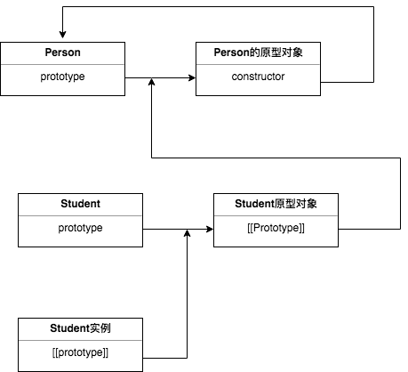

1. #### 原型对象

   理解原型对象：

   每个函数在创建时，都会根据一定的规则获得一个prototype属性，这个属性包含换一个指针，指向该函数的原型对象。而这个原型对象会自动获取一个constructor属性，它指向prototype属性所在的函数。如下图：

   

   也就是 Person === Person.prototype.constructor 返回true;

   如果是实例呢？当用构造函数创建实例时，该实例内部会获取到一个内部属性[[Prototype]]，而这个内部属性包含一个指向该构造函数的原型对象的指针。如下图：

   

   由图可知，这个链接是存在于实例和构造函数的原型对象之间，而非构造函数之间。

2. #### 原型链

   一提到原型链，大家可能会想到继承。然后继承又是怎么回事儿呢？

   有上面介绍原型，大家应该知道原型对象、constructor、实例之间的关系。想一下，如果让一个原型对象等于一个对象的实例会如何，以Person为栗子：

   ```javascript
   function Person() {
     
   }
   Person.prototype.sayName = function() {
     console.log('person')
   }
   
   function Student() {
     
   }
   //让student的原型等于Person的实例
   Student.prototype = new Person();
   
   var _stu = new Student();
   _stu.sayName(); //person
   ```

   如果用图来表示，则是：

   


### 


