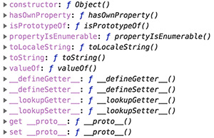

new官方解释：

> new运算符创建一个用户定义的对象类型的实例或者具有构造函数的内置对象的实例

首先我们先来看一下用new 调用函数的几个栗子：

1. 没有显示调用return的情况

   ```
   function Ani(name) {
     this.name = name;
   }
   Ani.prototype.say =  function() {
     console.log(this.name);
   }
   var _ani = new Ani('狗');
   console.log(_ani); // {name: "狗"}
   ```

2. return 返回一个对象

   ```
   function Ani(name) {
     this.name = name;
     return {name: '我就是显示返回的名字'}
   }
   Ani.prototype.say =  function() {
     console.log(this.name);
   }
   var _ani = new Ani('狗');
   console.log(_ani); // {name: '我就是显示返回的名字'}
   ```

3. return 返回一个原始对象

   ```
   function Ani(name) {
     this.name = name;
     return '狗狗'
   }
   Ani.prototype.say =  function() {
     console.log(this.name);
   }
   var _ani = new Ani('狗');
   console.log(_ani); // {name: "狗"}
   ```

通过上面的实例可以看出：

- 不显示返回和返回基本类型是一样的，返回最开始创建的对象
- 如果显示返回一个对象类型，则直接返回改对象

接下来我们在来看看 上面三种情况下，实例的[[Prototype]]属性，每个实例下面添加如下代码：

```
console.log(_ani.__proto__ === Ani.prototype);
```

结果显而易见：示例1、3 返回的都是true, 示例2 返回 false；

接下来我们修改一下Ani的原型，将其原型改成一个原始数据类型，想想上面的答案是否还是一样的：

```
Ani.prototype= 1；
```

有可能你会觉得是：示例1、3 返回的 还是true，只是他们的值都是1。

当然这是错的，我们将_ani的[[Prototype]]属性打印出来一看，你会发现三个示例的值都是：




我们再打印：

```
console.log(_ani.__proto__ === Ani.prototype) //false
console.log(_ani.__proto__ === Object.prototype); // true
```

没错，将Ani的原型重写为原始数据类型是，是示例的[[Prototype]]都指向的是都Object的原型对象

综上，我们来总结一下new这个关键字他到底做了哪些事儿？

1. 创建了一个新对象Object。
2. 给新创建对象的内部属性赋值，重要的是给[[Prototype]]赋值，如果构造函数的原型对象是不是对象类型，则实例的[[Prototype]]指向Object的 prototype
3. 执行构造函数里面的方法，执行过程中将this指向新对象
4. 返回新对象，如果构造函数有显示地返回一个对象数据类型，则直接返回该对象，否则返回新创建对象；

最后，我们就一起来 实现一个new的功能：

```
function ownNew() {
  var obj = new Object(); //创建新对象
  var _constructor = Array.prototype.shift.call(arguments);
  var res = _constructor.apply(obj, arguments);
  obj.__pro__ = _constructor.prototype; 
  return res instanceof Object ? res : obj; 
}
function Ani(name) {
  this.name = name;
}
var _ani = ownNew(Ani, '狗')
console.log(_ani); // {name: "狗"}

```


扩展思考：

- 1.如何判断数据类型？几种方式？各有什么差别？


  请参考我的  [javascript 数据类型判断](https://github.com/liyanging/articles/blob/master/javascript/javascript之数据类型判断.md)