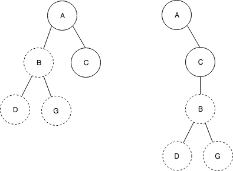
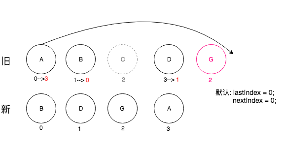

React 最重要的概念之一：diff算法。

React 要将 virtual Dom 转换成 真实的DOM树，这整个过程叫做调和(reconciliation)，diff算法则是这个调和的具体实现。那么React到底是如何实现diff算法的呢？

我们先来了解一下 diff策略：

1. DOM节点跨层级的移动很少，我们可以忽略不计。
2. 拥有相同类的两个组件将会生成相似的树形结构。相反，拥有不同类的两个组件将会生成不同的树形结构。
3. 对于同一层级的同一组节点，我们可以通过节点的唯一标识ID进行区分。

基于上面的三种策略，我们可以将React的算法优化分为：tree diff、component diff、element diff;

1. Tree diff

   React会对树进行分层比较，不同的两棵树只会对同一层级的节点进行比较。如果发现该节点不存在了，则会将该节点以及该节点下面的所有节点全部删除，根本不会进行比较。
   那么你可能会问，如果出现跨层级的移动呢？
   答案是：会直接删除被移动的节点，而在被移动到的节点下面添加改节点。(用图来表示：)

   

   将节点B以及B下面的所有节点都移动到节点C下面。由于React只会简单的考虑同层节点的移动，而对不同层级的节点只有简单的删除和创建。

   所以对于此次操作，diff算法的过程是：发现C下面多了B节点，则会直接创建B以及B的子节点。对比发现，与C同级的B节点没有了，则会直接删除B节点以及B的子节点。createB ---> createD ---> createG ---> deleteB.

   很容易发现这样的操作会非常影响性能的，所以官方建议：**不要进行DOM的跨层级操作**

2. Component diff

   1. 同一类型的组件，则按照原策略继续进行diff算法 比较 Virtual DOM。
   2. 不同类型的组件，则将该组件视为 dirty-component，从而替换整个组件下的所有子节点。
   3. 同一类型的组件，如果数据没有任何变化，也就是整个Virtual DOM 没有任何变化的话，则我们不需要进行任何的diff比较。如果我们能明确的知道这点，那便能节约很多diff运行时间，从而改善性能。React允许我们通过shouldComponentUpdate()方法来判断组件是否需要进行diff算法分析，默认返回true。所以我们可以在此方法里判断数据是否有变化，若无变化，则return false；

3. Element diff(最关键所在)

   处于同一层级的节点，diff算法提供了三种节点操作：插入、移动、删除

   1. INSERT_MARKU：即插入。新的节点在旧集合里面不存在，则是全新的节点，则需要对新节点进行插入操作。
   2. MOVE_EXISTING：即移动。相同节点，则可以对以前的节点复用，则需要进行移动操作。
   3. REMOVE_NODE：即删除。不能直接复用和更新的节点，需要执行删除操作。

   先来介绍一下diff算法是怎么运行的呢？我们先结合源码来分析一下：

   ```react
   _updateChildren: function(
         nextNestedChildrenElements,
         transaction,
         context,
       ) {
         var prevChildren = this._renderedChildren;
         var removedNodes = {};
         var mountImages = [];
         var nextChildren = this._reconcilerUpdateChildren(
           prevChildren,
           nextNestedChildrenElements,
           mountImages,
           removedNodes,
           transaction,
           context,
         );
         if (!nextChildren && !prevChildren) {
           return;
         }
         var updates = null;
         var name;
         var nextIndex = 0;
         var lastIndex = 0;
         var nextMountIndex = 0;
         var lastPlacedNode = null;
         //对新集合进行遍历
         for (name in nextChildren) {
           if (!nextChildren.hasOwnProperty(name)) {
             continue;
           }
           var prevChild = prevChildren && prevChildren[name];
           var nextChild = nextChildren[name];
           //判断是否属于相同节点
           if (prevChild === nextChild) {
             updates = enqueue(
               updates,
               this.moveChild(prevChild, lastPlacedNode, nextIndex, lastIndex),
             );
             lastIndex = Math.max(prevChild._mountIndex, lastIndex);
             prevChild._mountIndex = nextIndex;
           } else {
             if (prevChild) {
               lastIndex = Math.max(prevChild._mountIndex, lastIndex);
             }
             updates = enqueue(
               updates,
               this._mountChildAtIndex(
                 nextChild,
                 mountImages[nextMountIndex],
                 lastPlacedNode,
                 nextIndex,
                 transaction,
                 context,
               ),
             );
             nextMountIndex++;
           }
           nextIndex++;
           lastPlacedNode = ReactReconciler.getHostNode(nextChild);
         }
         // Remove children that are no longer present.
         for (name in removedNodes) {
           if (removedNodes.hasOwnProperty(name)) {
             updates = enqueue(
               updates,
               this._unmountChild(prevChildren[name], removedNodes[name]),
             );
           }
         }
         if (updates) {
           processQueue(this, updates);
         }
         this._renderedChildren = nextChildren;
   
         if (__DEV__) {
           setChildrenForInstrumentation.call(this, nextChildren);
         }
       },
   ```

   解说一下上面的的代码：

   得到新的集合，并对新集合进行遍历，并且通过唯一的标识key对新旧节点进行判断是否属于相同节点，if (prevChild === nextChild)，如果是相同节点，在进行移动。

   我们先来看看移动节点的源码：

   ```react
   moveChild: function(child, afterNode, toIndex, lastIndex) {
     // If the index of `child` is less than `lastIndex`, then it needs to
     // be moved. Otherwise, we do not need to move it because a child will be
     // inserted or moved before `child`.
     if (child._mountIndex < lastIndex) {
     	return makeMove(child, afterNode, toIndex);
     }
   },
   ```

   可以得知，在移动之前，会先判断当前节点在旧集合的位置（child._mountIndex） 与 lastIndex相比较，只有满足（child._mountIndex < lastIndex）的情况下，才进行移动操作。当初我看代码的时候，不明白为何要加这个判断，或者说这个判断妙在何处，后来看分析才知道，这是一个顺序优化手段。

   我们先来看看 lastIndex的取值：lastIndex = Math.max(prevChild._mountIndex, lastIndex);

   lastIndex指的是：表示访问过的节点在旧集合中最右的位置(即最大的位置)

   妙处：如果新访问的节点在旧集合里面的位置大于 lastIndex。说明这个节点在上一个访问节点的后面，该节点不会对其他的节点有任何影响，所以不需要执行移动操作。


   听起来是不是很晕？下面举例来说明：（现在进入飙戏环节，小板凳都准备好了吗？）

   

   开始遍历新集合：_mountIndex(相应节点在旧集合里面的位置)

   1. B：_mountIndex = 1 > lastIndex，不移动。更新lastIndex =  Math.max(prevChild._mountIndex, lastIndex)，此时lastIndex = 1;并将旧集合中B节点的mountIndex 更改为 新集合中的 mountIndex，即prevChild._mountIndex = nextIndex = 0;  nextIndex ++ ；
   2. D: _mountIndex = 3 > lastIndex，不移动。更新lastIndex =  Math.max(prevChild._mountIndex, lastIndex)，此时lastIndex = 3;  并将旧集合中B节点的mountIndex 更改为 新集合中的 mountIndex，即prevChild._mountIndex = nextIndex = 1;  nextIndex ++ ；
   3. A: _mountIndex = 0 < lastIndex，移动。执行makeMove(child, afterNode, toIndex)，toIndex也就是该节点在新集合的位置 ,也就是：toIndex = nextIndex = 2； nextIndex ++；
   4. E: _mountIndex = 4 > lastIndex， 不移动。更新lastIndex =  Math.max(prevChild._mountIndex, lastIndex)，此时lastIndex = 4;  并将旧集合中B节点的mountIndex 更改为 新集合中的 mountIndex，即prevChild._mountIndex = nextIndex = 3;  nextIndex ++ ；
   5. C: _mountIndex = 2 < lastIndex，移动。执行makeMove(child,afterNode,toIndex)，toIndex也就是该节点在新集合的位置 ,也就是：toIndex = nextIndex = 4；；

   这样diff下来，最终需要移动位置的节点只有：A和C节点。


   下面我们来分析一下如果存在 移动、插入、删除三种情况，diff又该如何运算呢？

   

   开始遍历新集合：_mountIndex(相应节点在旧集合里面的位置)

   1. B：旧集合中存在，_mountIndex = 1 > lastIndex，不移动。改变旧节点的mountIndex 为 nextIndex；更新lastIndex =  Math.max(prevChild._mountIndex, lastIndex)，此时lastIndex = 1; nextIndex++；
   2. D：旧集合中存在，_mountIndex = 3 > lastIndex，不移动。改变旧节点的mountIndex 为 nextIndex；更新lastIndex =  Math.max(prevChild._mountIndex, lastIndex)，此时lastIndex = 3; nextIndex++；
   3. G：旧集合中不存在，则创建G节点，并且执行插入操作，并且G的位置为新集合中的位置。 nextIndex++；
   4. A：旧集合中存在，mountIndex = 0 < lastIndex，移动。移动到的位置为新集合中的位置，即3。
   5. 新集合已经遍历完毕，但是还需要对旧集合进行循环遍历，判断是否存在：在就集合中存在，但是新集合中不存在的节点，如果有，则需要执行删除操作。这样便发现了C节点，删除C节点，到此整个diff算法便全部操作完；


   官方建议：

   > 在开发过程中，尽量减少类似将最后一个节点移动到列表首部的操作。当节点数量过大 
   >
   > 或更新操作过于频繁时，这在一定程度上会影响 React 的渲染性能。 

   大家很容易想到原因，这里我就不多说了。