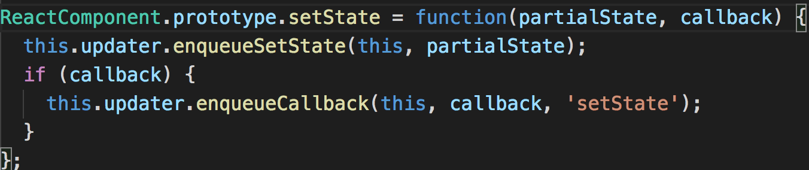
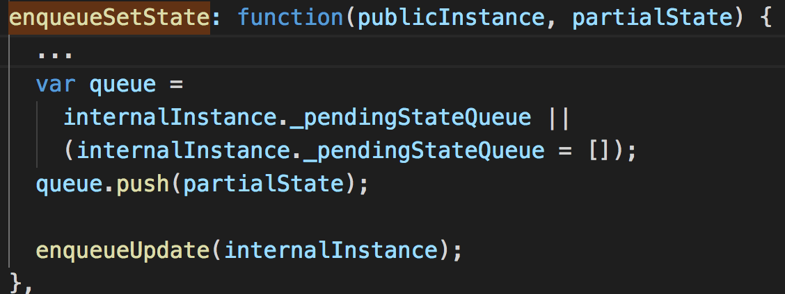
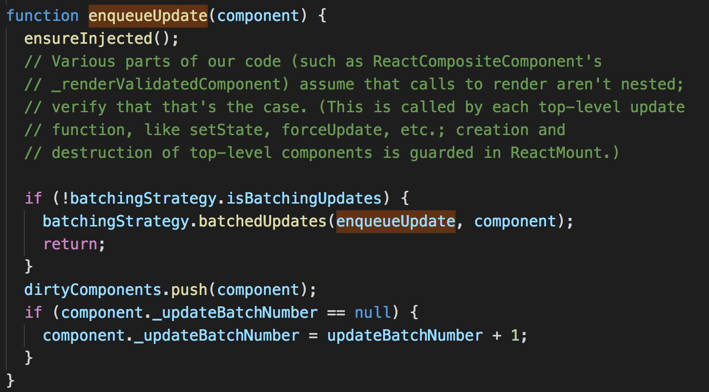
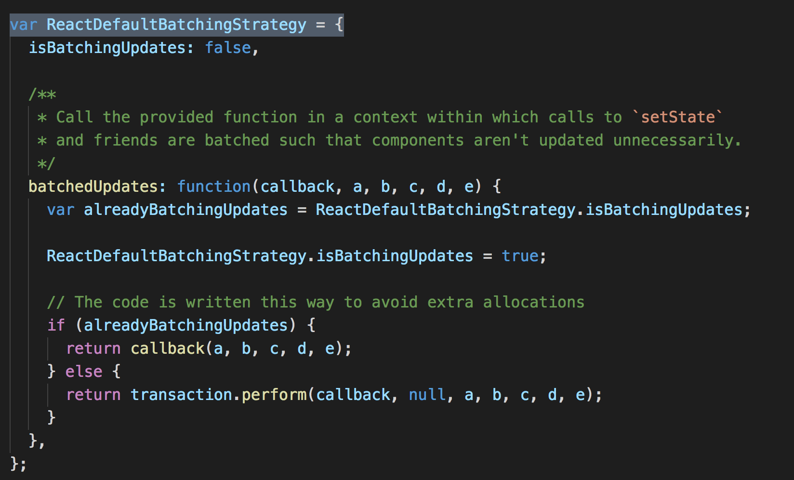
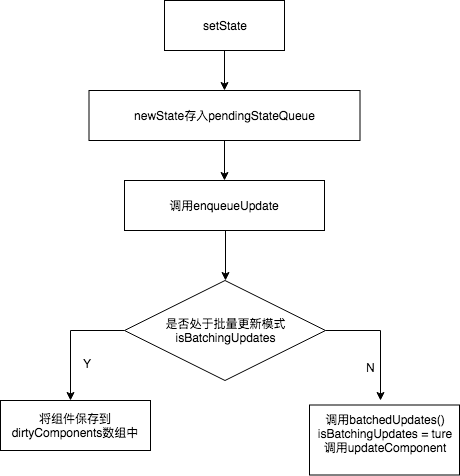
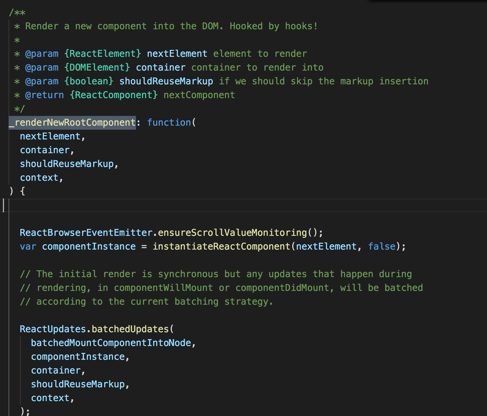
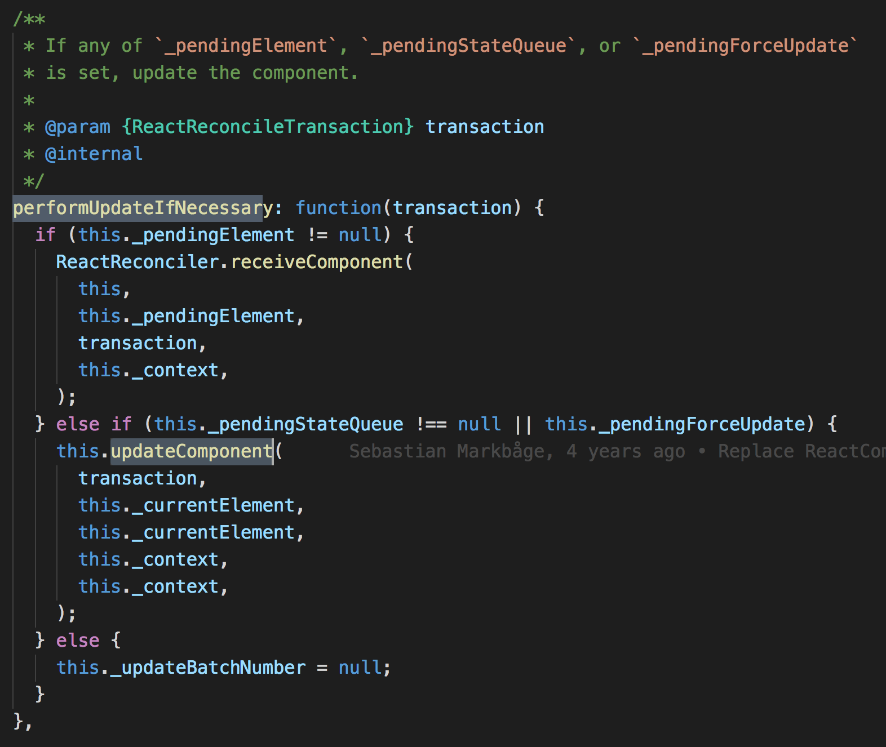

刚开始学习React的时候，可能会写出this.state.name='ll'的代码，当然随着学习的深入，你会发现，这样的写法是完全错误的：不仅低效，而且很容易被覆盖。（为什么呢？）

首先我们来看看正确的姿势是什么：this.setState({name: 'll'})；

接下来我们由一到思考题慢慢的揭开 setState的神秘面纱：

```react
import React, { Component } from 'react';
class Example extends Component { 
  constructor() {
    super(); 
    this.state = {
      val: 0 
    };
	}
	componentDidMount() {
    this.setState({val: this.state.val + 1}); 
    console.log(this.state.val); // 第 1 次输出
    this.setState({val: this.state.val + 1}); 
    console.log(this.state.val); // 第 2 次输出
    setTimeout(() => {
      this.setState({val: this.state.val + 1}); 
      console.log(this.state.val); // 第 3 次输出
      this.setState({val: this.state.val + 1});
      console.log(this.state.val); // 第 4 次输出
    }, 0);
	}
}	
```

上面代码，四次打印出来的结果依次是：0、0、2、3。

我们先来看一下setState的相关源码：



这方法相对简单，直接调用了enqueueSetState，接下来我们看看enqueueSetState方法:



接下来便是最终要的 enqueueUpdate方法了，然而这里面做了什么呢？我们接着看



有源码可知，先会判断是否处于批量更新模式(isBatchingUpdates是否为ture)，如果不是，则调用更新方法，如果处于批量更新模式，则将组件保存到 dirtyComponents数组里面。

到这里，大家可能会想batchingStrategy是何方神圣？其实batchingStrategy是个简单的对象，我们来看源码：



简单的定义了一个对象和一个方法：isBatchingUpdates和batchedUpdates（），这里值得注意的是：batchedUpdates方法里面的transction.perform。有关transction的讲解请参考:

[]: http://front-ender.me/react/react-transaction.html

用一张流程图总结上面的流程则是：



由上面的栗子可知：componentDidMount前两次打印均为0，说明componentDidMount的时候，已经处于批量更新模式了，也就是isBatchingUpdates=true了。但是我们看源码可知，isBatchingUpdates的默认值是false，那什么时候调用batchedUpdates方法将isBatchingUpdates设为true了呢？往上追溯我们可以知道，原来是ReactMount.js里面的_renderNewRootComponent方法调用该方法，看源码：



该方法是将新组建渲染到DOM之后调用的，也就是说第一次执行render之后?(对生命周期不熟的同学可以看看： [React生命周期解析](https://github.com/liyanging/articles/blob/master/react/life-cycle.md))。这样就能解释上面的栗子：在componentDidMount方法调用setState()，不会立即更新state的值，因为此时isBatchingUpdates为true，进入了批量更新模式。

（官方解释：整个将组件渲染到DOM中的过程就处于一个大事务中）


下面我们来思考一个问题：如果在shouldComponentUpdate和componentWillUpdate调用this.setState()方法会发生什么？

我们直接看源码:



此时this._pendingStateQueue !== null，则调用this.updateComponent方法，而该方法又会调用shouldComponentUpdate和componentWillUpdate,因此会造成循环调用，是浏览器内存沾满直至崩溃。

（如有说得不妥之处，欢迎来喷。之后会继续补充和完善。。。）

